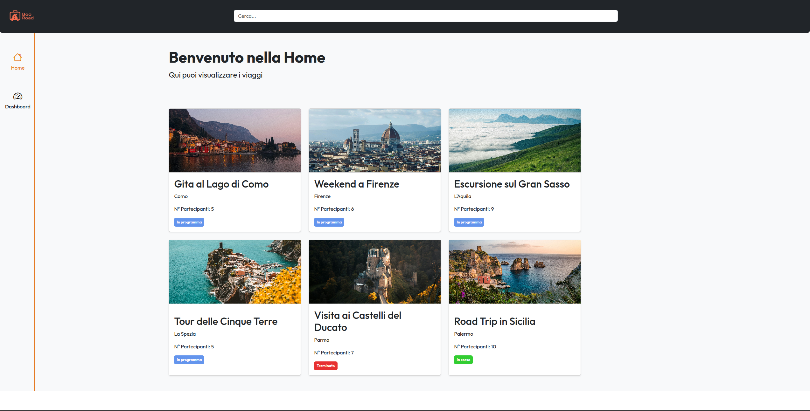
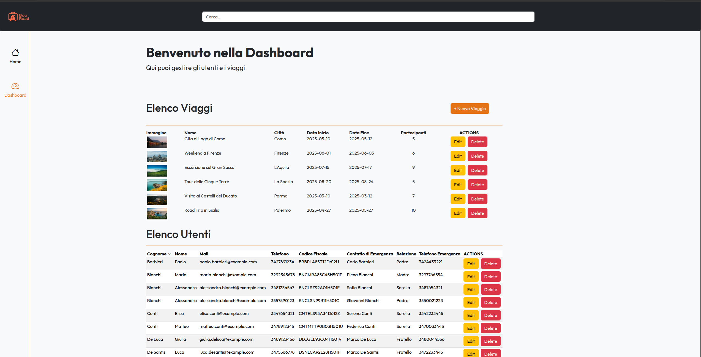
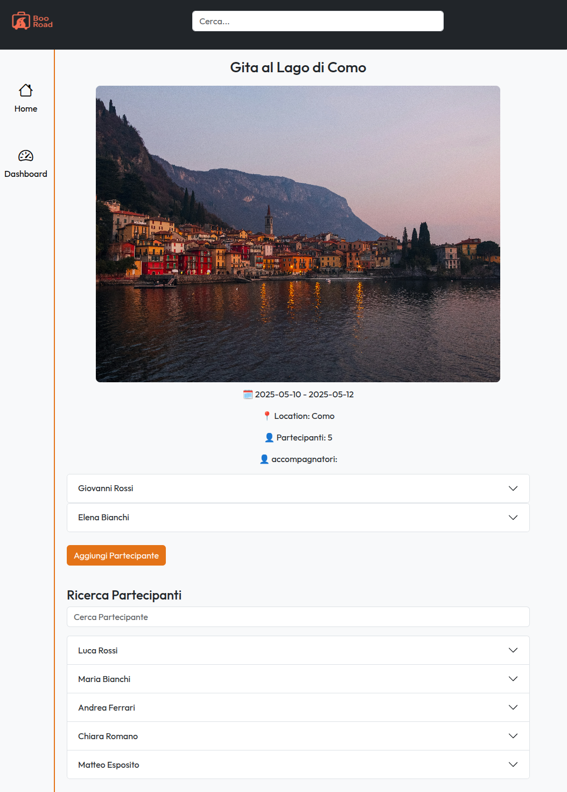

# BooRoad

BooRoad è un'applicazione web per la gestione e la visualizzazione di viaggi. Gli utenti possono esplorare i viaggi disponibili, visualizzare i dettagli di ciascun viaggio e aggiungere nuovi viaggi.

## Funzionalità principali

- **Home Page**: Visualizza una lista di viaggi con dettagli come nome, località, numero di partecipanti e stato (attivo/inattivo).
- **Ricerca**: Barra di ricerca per filtrare i viaggi in base al nome o alla città.
- **Dettagli del Viaggio**: Ogni viaggio ha una pagina dedicata con informazioni dettagliate.
- **Aggiunta di Viaggi**: Possibilità di aggiungere nuovi viaggi tramite un modulo.
- **Navigazione Intuitiva**: Navbar con collegamenti rapidi e un logo personalizzato.

  
### Dashboard

### Pagina Dettaglio

## Tecnologie utilizzate

- **Frontend**: React.js
- **Routing**: React Router
- **Stile**: Bootstrap 5 e Bootstrap Icons
- **Gestione Stato**: Context API per la condivisione dei dati tra i componenti

## Struttura del progetto

- **`src/components`**: Contiene i componenti riutilizzabili come `TravelCard`, `Header`, `SearchBar`, ecc.
- **`src/pages`**: Contiene le pagine principali come `Home`.
- **`src/contexts`**: Contiene il contesto per la gestione dello stato globale (`TripContext`).
- **`src/assets`**: Contiene le risorse statiche come immagini e il logo.
